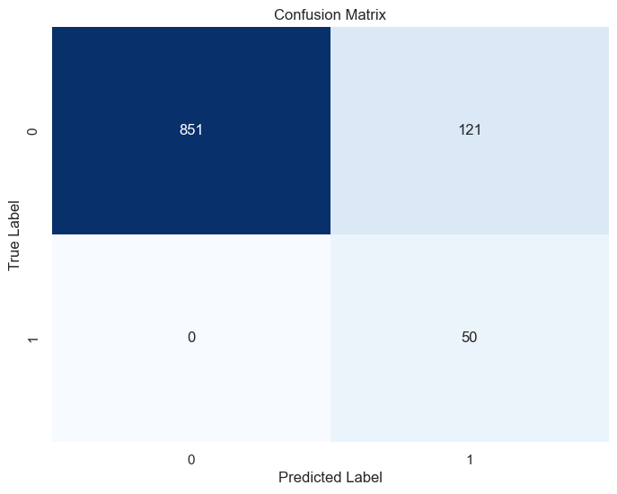

# Stroke Prediction Project

## Goal
The ultimate goal of this project is to create an algorithm for **automated stroke risk alert** within the medical record system. The [Stroke Prediction Dataset](https://www.kaggle.com/datasets/fedesoriano/stroke-prediction-dataset) serves as our training data.

## Structure of the Project
The objectives are:
- Perform **Exploratory Data Analysis** (EDA) to understand the given sample and its modeling considerations.
- Perform **Statistical Inference**.
- **Model the stroke risk**.
- Conduct a simple **deployment of the best model**.

## Methods
- EDA
- Statistical tests: **χ²** and **Mann-Whitney U test**
- **SHAP** (SHapley Additive exPlanations)
- **Tree-based models**: Random Forest, XGBoost, LightGBM
- **Various Feature Engineering techniques**
- **Optuna** for hyperparameter optimization

## Results
Balanced Accuracy Score of the test set is 94%. While that might sound pretty good, we only get the precision of circa. 30% for the positive class. Attempting to reduce the number of False-Positives is a constant theme in this project.
### Best Model Hyperparameters (Optimized with Optuna):
```python
{
 'boosting_type': 'dart',
 'n_estimators': 211,
 'learning_rate': 0.12069620923968828,
 'max_depth': 9,
 'num_leaves': 61,
 'min_child_samples': 95,
 'subsample': 0.22400803435074426,
 'colsample_bytree': 0.6430616569091118,
 'reg_alpha': 0.1204662169594321,
 'reg_lambda': 0.27645458510111576
}
```
### Classification Report (test data)
| Class            | Precision | Recall | F1-Score | Support |
|------------------|-----------|--------|----------|---------|
| **Non-Stroke (0)** | 1.00      | 0.88   | 0.93     | 972     |
| **Stroke (1)**     | 0.29      | 1.00   | 0.45     | 50      |
| **Accuracy**       |           |        | 0.88     | 1022    |
| **Macro Avg**      | 0.65      | 0.94   | 0.69     | 1022    |
| **Weighted Avg**   | 0.97      | 0.88   | 0.91     | 1022    |

### Confusion Matrix:

